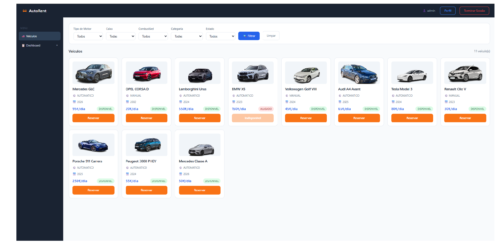
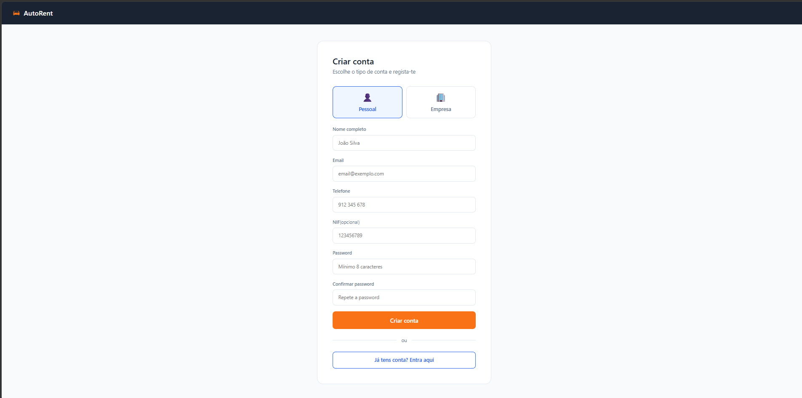
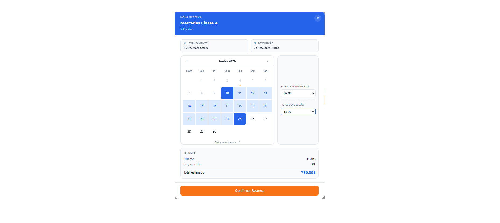
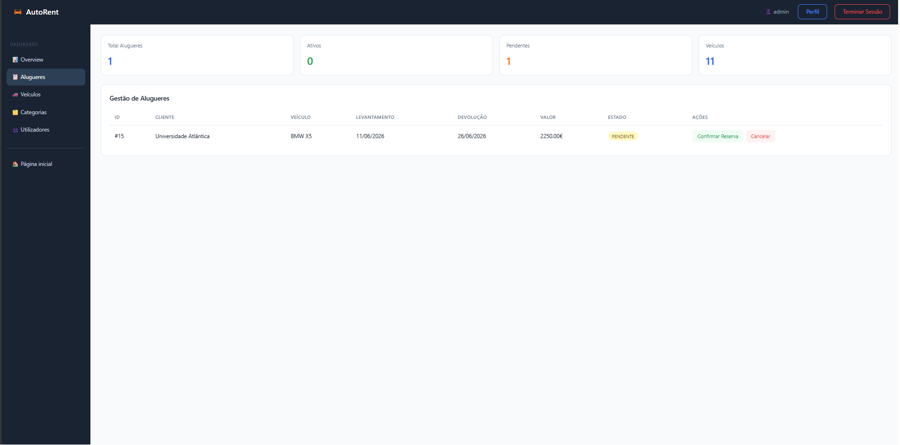
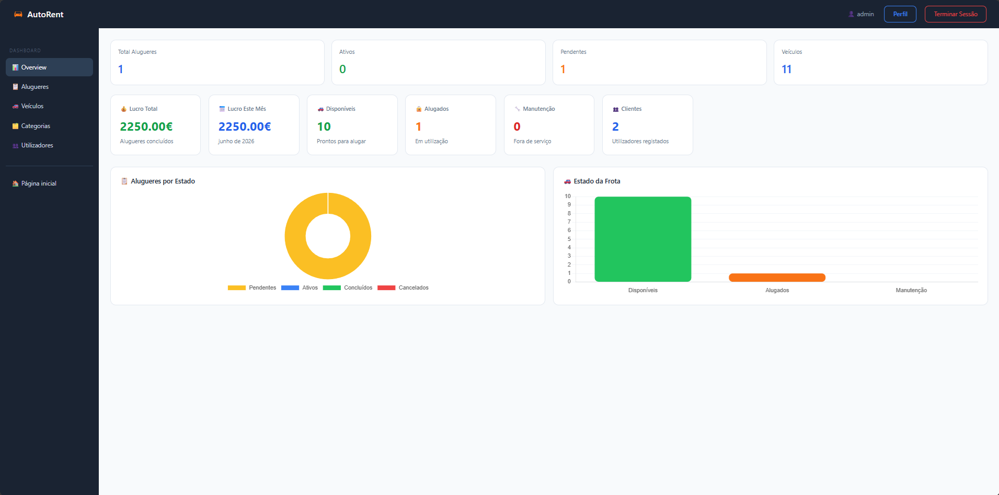
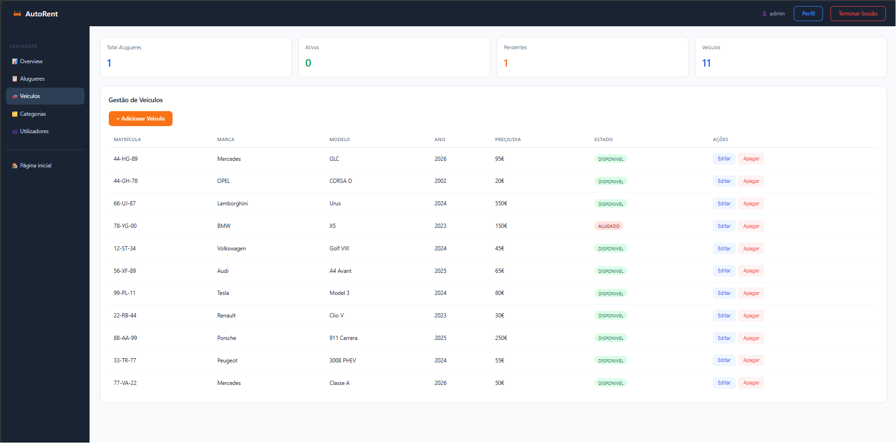
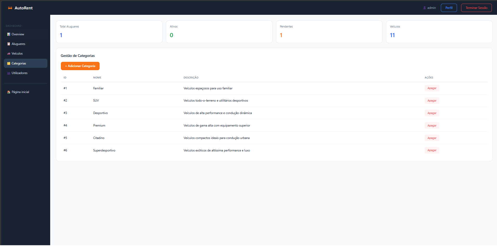
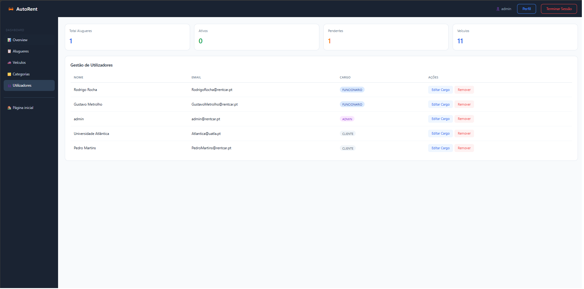

# 🚗 AutoRent — Car Rental Management System

A full-stack car rental management system built with Java and Spring Boot, featuring a complete vehicle booking platform with user authentication, an interactive booking calendar, and a comprehensive admin dashboard.

## 📸 Screenshots

### 🏠 Vehicle Catalogue


### 🔐 Authentication



### 📅 Booking Calendar


### 📋 Current Rentals


### 🛡️ Admin Dashboard





## 🛠️ Tech Stack

**Backend**
- Java 17
- Spring Boot
- Spring Data JPA / Hibernate
- MySQL (hosted on Aiven)
- Thymeleaf

**Frontend**
- HTML5 & CSS3
- JavaScript
- REST API integration

## ✨ Features

- 🔐 **User authentication** — Login and registration for personal and business accounts
- 🚘 **Vehicle catalogue** — Browse available cars with images, pricing and filters (type, fuel, gearbox, category, status)
- 📅 **Booking system** — Interactive calendar to select pickup and return dates with real-time price calculation
- 📋 **Rental tracking** — View and manage current rentals with status updates
- 🛡️ **Admin dashboard** — Full control over vehicles, users, categories and rentals with charts and statistics
- 👥 **Role-based access** — Client, Employee and Admin roles with different permissions
- 📁 **Category management** — Organise vehicles by category (Familiar, SUV, Desportivo, Premium, Citadino, Superdesportivo)

## 🗂️ Project Structure

```
src/
└── main/
    └── java/
        ├── controller/        # REST controllers (Aluguer, Categoria, Utilizador, Veiculo)
        ├── enums/             # Status, Cargo, Tipo_Caixa, Tipo_Combustao, Tipo_Motor
        ├── model/             # Entities (Aluguer, Categoria, Utilizador, Veiculo)
        ├── repository/        # JPA repositories
        ├── service/           # Business logic
        └── stand/             # Application entry point
    └── resources/
        ├── static/
        │   ├── css/           # Stylesheets
        │   ├── img/           # Vehicle images & screenshots
        │   └── js/            # JavaScript (api.js, dashboard.js)
        └── templates/         # HTML pages (index, login, register, dashboard, perfil, admin)
```

## 🚀 Getting Started

### Prerequisites
- Java 17+
- Maven
- MySQL database

### Installation

1. Clone the repository
```bash
git clone https://github.com/GMetrolho/rent-a-car-app.git
cd rent-a-car-app
```

2. Create the `application.properties` file in `src/main/resources/` with your database credentials:
```properties
spring.datasource.url=jdbc:mysql://localhost:3306/rentacar
spring.datasource.username=your_username
spring.datasource.password=your_password

spring.jpa.hibernate.ddl-auto=update
spring.jpa.show-sql=true
spring.jpa.properties.hibernate.dialect=org.hibernate.dialect.MySQLDialect

spring.thymeleaf.cache=false

server.port=8081
```

3. Run the application
```bash
mvn spring-boot:run
```

4. Open your browser at `http://localhost:8081`

## 👥 Authors

- **Gustavo Metrolho** — [@GMetrolho](https://github.com/GMetrolho)
- **Rodrigo Rocha** — [@azunieee](https://github.com/azunieee)

## 💼 Available for Freelance

I'm open to freelance projects. Feel free to reach out!

📧 gmetrolho@gmail.com